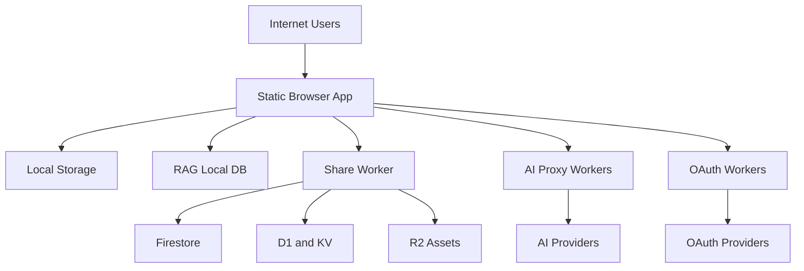

# GoToolkit Threat Model

## Executive summary

The dominant risk themes for this repository are cross-tenant confidentiality failures in the cloud-share system, browser-side credential exposure in a highly capable client application, and abuse of browser-facing worker proxies that sit in front of paid third-party APIs. The highest-risk areas are the share/sync/storage path in `workers/share-proxy`, browser storage and runtime globals in the frontend, and the worker-backed OAuth/integration flows that bridge user browsers to external providers.

## Scope and assumptions

- In-scope paths:
  - `public/`
  - `src/`
  - `workers/`
  - `firebase.json`
- Out of scope:
  - CI/CD beyond what is visible in repo docs/config
  - Cloud provider account posture, firewall/WAF, and secret-management practices not visible in code
  - Third-party upstream providers beyond the trust assumptions in their APIs
- Assumptions confirmed by user:
  - `gotoolkit.fr` is a public internet-facing production deployment.
  - The product is used across `2` to `5` organizations, so tenant isolation matters.
  - Shared pages and assets should be treated as confidential by default.
- Additional assumptions:
  - The static app is delivered to untrusted browsers and should be treated as a hostile runtime.
  - Workers are internet-reachable and rely on application-layer controls rather than network isolation.
  - Browser local state may contain confidential business content, prompts, keys, and sync metadata.

- Open questions that would materially change ranking:
  - Whether all asset URLs are intentionally shareable outside authenticated spaces.
  - Whether managed spaces such as `golive` are production tenants or operational/admin spaces only.
  - Whether additional runtime controls exist at Cloudflare or Firebase Hosting beyond the repo-visible CSP and worker logic.

## System model

### Primary components

- Static browser application:
  - HTML entrypoints in `public/index.html`, `public/grid.html`, `public/home.html`, `public/mobile.html`
  - Stores local state in `localStorage` and IndexedDB, including docs, sync metadata, and some user-supplied API keys
  - Evidence: [public/index.html](/mnt/c/Users/tranx/Documents/Github/gotoolkit/public/index.html), [public/js/document-storage.js](/mnt/c/Users/tranx/Documents/Github/gotoolkit/public/js/document-storage.js), [public/js/ia-config.js](/mnt/c/Users/tranx/Documents/Github/gotoolkit/public/js/ia-config.js)
- Memo/editor and rich content pipeline:
  - React/Tiptap editor bridge with HTML/Markdown/JSON export and media/embed support
  - Evidence: [src/memo-bridge/index.tsx](/mnt/c/Users/tranx/Documents/Github/gotoolkit/src/memo-bridge/index.tsx), [src/memo-editor/simple-editor.tsx](/mnt/c/Users/tranx/Documents/Github/gotoolkit/src/memo-editor/simple-editor.tsx)
- Local-first knowledge/RAG layer:
  - IndexedDB-backed document ingestion, chunking, embeddings, OCR, and retrieval
  - Evidence: [public/js/document-rag.js](/mnt/c/Users/tranx/Documents/Github/gotoolkit/public/js/document-rag.js)
- Cloud share and sync layer:
  - Browser client in `public/js/share-worker-client.js` and sync orchestration in `public/js/space-sync.js`
  - Backend in `workers/share-proxy/index.js` with Firestore, D1, KV, and R2
  - Evidence: [public/js/share-worker-client.js](/mnt/c/Users/tranx/Documents/Github/gotoolkit/public/js/share-worker-client.js), [public/js/space-sync.js](/mnt/c/Users/tranx/Documents/Github/gotoolkit/public/js/space-sync.js), [workers/share-proxy/index.js](/mnt/c/Users/tranx/Documents/Github/gotoolkit/workers/share-proxy/index.js)
- Browser-facing paid API proxies:
  - OpenRouter, AssemblyAI, Google TTS
  - Evidence: [workers/openrouter-proxy/index.js](/mnt/c/Users/tranx/Documents/Github/gotoolkit/workers/openrouter-proxy/index.js), [workers/assemblyai-proxy/index.js](/mnt/c/Users/tranx/Documents/Github/gotoolkit/workers/assemblyai-proxy/index.js), [workers/googletts-proxy/index.js](/mnt/c/Users/tranx/Documents/Github/gotoolkit/workers/googletts-proxy/index.js)
- OAuth-backed integration workers:
  - YouTube, Gmail, Notion, Microsoft
  - Evidence: [workers/youtube-proxy/index.js](/mnt/c/Users/tranx/Documents/Github/gotoolkit/workers/youtube-proxy/index.js), [workers/gmail-proxy/index.js](/mnt/c/Users/tranx/Documents/Github/gotoolkit/workers/gmail-proxy/index.js), [workers/notion-proxy/index.js](/mnt/c/Users/tranx/Documents/Github/gotoolkit/workers/notion-proxy/index.js), [workers/ms-proxy/index.js](/mnt/c/Users/tranx/Documents/Github/gotoolkit/workers/ms-proxy/index.js)

### Data flows and trust boundaries

- Internet user browser -> Static app
  - Data: documents, prompts, API keys, media, shared-space secrets, OAuth session initiation
  - Channel: HTTPS static hosting
  - Security guarantees: CSP present, but allows `unsafe-inline`; no server-side trusted session for most app state
  - Validation/normalization: mixed; much of the trust is shifted to browser code
  - Evidence: [public/index.html](/mnt/c/Users/tranx/Documents/Github/gotoolkit/public/index.html#L7), [firebase.json](/mnt/c/Users/tranx/Documents/Github/gotoolkit/firebase.json#L21)
- Browser -> Share worker
  - Data: shared page payloads, page metadata, asset uploads, space codes, OAuth identity assertions, sync tokens
  - Channel: HTTPS JSON API
  - Security guarantees: origin checks, `X-Space-Auth`, sync replay headers, rate limiting on writes, some D1/KV-backed controls
  - Validation/normalization: route parsing, `spaceId` normalization, token verification, collection allowlist, asset mime restrictions
  - Evidence: [public/js/share-worker-client.js](/mnt/c/Users/tranx/Documents/Github/gotoolkit/public/js/share-worker-client.js#L90), [workers/share-proxy/index.js](/mnt/c/Users/tranx/Documents/Github/gotoolkit/workers/share-proxy/index.js#L1852)
- Share worker -> Firestore / D1 / KV / R2
  - Data: shared pages, metadata, space auth hashes, sync replay state, media assets
  - Channel: provider bindings/API calls
  - Security guarantees: worker-only access, app-layer auth before most protected operations
  - Validation/normalization: partial; correctness depends on `spaceId` scoping and route behavior
  - Evidence: [workers/share-proxy/index.js](/mnt/c/Users/tranx/Documents/Github/gotoolkit/workers/share-proxy/index.js#L1572), [workers/share-proxy/index.js](/mnt/c/Users/tranx/Documents/Github/gotoolkit/workers/share-proxy/index.js#L1765)
- Browser -> Paid API proxy workers
  - Data: prompts, embeddings input, text-to-speech requests, transcription requests, user-supplied API keys
  - Channel: HTTPS JSON/API proxy
  - Security guarantees: origin allowlists, Turnstile on some routes, rate limiting
  - Validation/normalization: basic payload size and JSON checks, limited abuse friction
  - Evidence: [workers/openrouter-proxy/index.js](/mnt/c/Users/tranx/Documents/Github/gotoolkit/workers/openrouter-proxy/index.js#L35), [workers/assemblyai-proxy/index.js](/mnt/c/Users/tranx/Documents/Github/gotoolkit/workers/assemblyai-proxy/index.js#L28), [workers/googletts-proxy/index.js](/mnt/c/Users/tranx/Documents/Github/gotoolkit/workers/googletts-proxy/index.js#L65)
- Browser -> OAuth workers -> external providers
  - Data: OAuth state, session cookies, access tokens, identity assertions, account metadata
  - Channel: HTTPS redirects, popup postMessage, provider API calls
  - Security guarantees: origin checks, nonce/state handling, `HttpOnly` cookies, server-side token persistence
  - Validation/normalization: target origin normalization and callback state consumption
  - Evidence: [workers/youtube-proxy/index.js](/mnt/c/Users/tranx/Documents/Github/gotoolkit/workers/youtube-proxy/index.js#L114), [workers/youtube-proxy/index.js](/mnt/c/Users/tranx/Documents/Github/gotoolkit/workers/youtube-proxy/index.js#L501)
- Browser app -> localStorage / IndexedDB
  - Data: local documents, RAG chunks and embeddings, cloud draft state, API keys, session metadata, prompt presets
  - Channel: browser local persistence
  - Security guarantees: same-origin browser storage only; no secrecy against XSS, extensions, or local compromise
  - Validation/normalization: minimal; storage mainly used as convenience and persistence
  - Evidence: [public/js/document-storage.js](/mnt/c/Users/tranx/Documents/Github/gotoolkit/public/js/document-storage.js#L1), [public/js/document-rag.js](/mnt/c/Users/tranx/Documents/Github/gotoolkit/public/js/document-rag.js#L73), [public/js/ia-config.js](/mnt/c/Users/tranx/Documents/Github/gotoolkit/public/js/ia-config.js#L35)

#### Diagram

## Assets and security objectives

| Asset | Why it matters | Security objective (C/I/A) |
|---|---|---|
| Shared pages and page metadata | Contains tenant business content and structure | C/I |
| Shared media assets | May contain confidential documents, screenshots, recordings, or encrypted payload references | C/I |
| Space auth tokens and space codes | Gate access to protected shared spaces | C/I |
| OAuth sessions and provider access tokens | Permit access to Gmail, Notion, Microsoft, YouTube actions/data | C/I |
| Browser-stored API keys | Can be reused to spend money or access third-party services | C |
| Local IndexedDB documents, chunks, embeddings | Contain user data and semantic representations of confidential content | C/I |
| Worker-held signing secrets and managed space codes | Anchor auth integrity and tenant access issuance | C/I |
| Availability-critical worker budgets and quotas | Paid proxies and sync/storage routes can be abused for cost or denial of service | A |
| Tenant isolation metadata such as `spaceId` | Prevents cross-org data access in a small multi-tenant deployment | C/I |

## Attacker model

### Capabilities

- Remote internet attacker can interact with public static pages and browser-facing workers.
- Authenticated tenant user can attempt horizontal access to other tenant data.
- Attacker can coerce a victim browser into loading crafted shared content or links.
- Attacker can replay, automate, and enumerate public worker endpoints within rate-limit constraints.
- Browser compromise class attacks are in scope as consequence amplifiers:
  - XSS
  - malicious extension
  - local browser compromise

### Non-capabilities

- Attacker is not assumed to have direct provider-console, Cloudflare account, Firebase account, or D1 admin access.
- Attacker is not assumed to control upstream providers such as Google, OpenRouter, or AssemblyAI.
- Physical device compromise and insider developer compromise are not the baseline threat assumptions for ranking.

## Entry points and attack surfaces

| Surface | How reached | Trust boundary | Notes | Evidence (repo path / symbol) |
|---|---|---|---|---|
| Main docs app | Public HTTPS page load | Internet -> browser app | High-capability single-page app with large local state surface | [public/index.html](/mnt/c/Users/tranx/Documents/Github/gotoolkit/public/index.html) |
| Grid app | Public HTTPS page load | Internet -> browser app | Separate rich workflow surface with local persistence | [public/grid.html](/mnt/c/Users/tranx/Documents/Github/gotoolkit/public/grid.html) |
| Share auth routes | `POST /v1/spaces/auth*` | Browser -> share worker | Issues and rotates space auth based on code or OAuth identity | [workers/share-proxy/index.js](/mnt/c/Users/tranx/Documents/Github/gotoolkit/workers/share-proxy/index.js#L1572) |
| Share CRUD routes | `/v1/shares/...` | Browser -> share worker | Protected collections rely on `X-Space-Auth` and `spaceId` scoping | [workers/share-proxy/index.js](/mnt/c/Users/tranx/Documents/Github/gotoolkit/workers/share-proxy/index.js#L1834) |
| Asset routes | `/v1/assets/...` | Browser -> share worker | Upload/delete protected; read path currently unauthenticated | [workers/share-proxy/index.js](/mnt/c/Users/tranx/Documents/Github/gotoolkit/workers/share-proxy/index.js#L1738) |
| OpenRouter proxy | Worker endpoint | Browser -> AI proxy | Shared paid upstream, guarded by origin and Turnstile | [workers/openrouter-proxy/index.js](/mnt/c/Users/tranx/Documents/Github/gotoolkit/workers/openrouter-proxy/index.js#L102) |
| AssemblyAI proxy | Worker endpoint | Browser -> AI proxy | Accepts explicit user API key or worker fallback | [workers/assemblyai-proxy/index.js](/mnt/c/Users/tranx/Documents/Github/gotoolkit/workers/assemblyai-proxy/index.js#L96) |
| Google TTS proxy | Worker endpoint | Browser -> AI proxy | Paid API surface with worker-held or user-provided credentials | [workers/googletts-proxy/index.js](/mnt/c/Users/tranx/Documents/Github/gotoolkit/workers/googletts-proxy/index.js#L116) |
| OAuth start/callback flows | Popup/redirect flow | Browser -> OAuth worker -> provider | Stateful session and popup postMessage flow | [workers/youtube-proxy/index.js](/mnt/c/Users/tranx/Documents/Github/gotoolkit/workers/youtube-proxy/index.js#L470) |
| Local browser persistence | Automatic on user actions | Browser runtime -> local storage | Confidentiality depends entirely on browser trust | [public/js/document-storage.js](/mnt/c/Users/tranx/Documents/Github/gotoolkit/public/js/document-storage.js#L1), [public/js/ia-config.js](/mnt/c/Users/tranx/Documents/Github/gotoolkit/public/js/ia-config.js#L35) |

## Top abuse paths

1. Attacker obtains or guesses a shared asset URL, fetches `/v1/assets/:id` without `X-Space-Auth`, and exfiltrates confidential tenant media.
2. Attacker exploits any browser-side script injection path or malicious extension and steals API keys, local documents, sync drafts, and tenant metadata from `localStorage` and IndexedDB.
3. Tenant user or malformed payload omits `spaceId`, triggering fallback scoping to `golive`, causing mis-scoped reads or writes in protected collections.
4. Attacker automates browser-facing paid worker endpoints, consuming OpenRouter, AssemblyAI, or TTS budgets despite origin checks and Turnstile friction.
5. Attacker compromises a low-privilege tenant account or share credential, then attempts lateral access across organizations through share tree, metadata, or asset references.
6. Attacker abuses OAuth popup and identity flows to hijack or confuse target-origin/session assumptions, seeking provider-connected actions on behalf of a victim.
7. Attacker uploads or references crafted content that persists in the client, then leverages downstream rendering/export flows to turn stored data into credential or content theft.

## Threat model table

| Threat ID | Threat source | Prerequisites | Threat action | Impact | Impacted assets | Existing controls (evidence) | Gaps | Recommended mitigations | Detection ideas | Likelihood | Impact severity | Priority |
|---|---|---|---|---|---|---|---|---|---|---|---|---|
| TM-001 | Remote internet attacker or unauthorized tenant | Asset URL disclosure or acquisition of encoded asset id | Read confidential assets from `/v1/assets/:id` without space auth | Cross-tenant confidentiality breach of media and shared content | Shared media assets, tenant confidentiality | Upload and delete require `X-Space-Auth`; asset metadata stores `spaceId` ([workers/share-proxy/index.js](/mnt/c/Users/tranx/Documents/Github/gotoolkit/workers/share-proxy/index.js#L1765), [workers/share-proxy/index.js](/mnt/c/Users/tranx/Documents/Github/gotoolkit/workers/share-proxy/index.js#L1174)) | Read path does not enforce `X-Space-Auth` and marks responses public-cacheable ([workers/share-proxy/index.js](/mnt/c/Users/tranx/Documents/Github/gotoolkit/workers/share-proxy/index.js#L1738)) | Require auth for confidential asset reads or introduce signed short-lived download tokens; separate public vs private asset classes | Log asset reads by `assetId`, tenant, origin, and auth presence; alert on unauthenticated bursts and cross-origin anomalies | High | High | high |
| TM-002 | XSS attacker, malicious extension, or local browser compromise | Ability to execute in victim browser context | Exfiltrate API keys, local docs, embeddings, sync drafts, and metadata from browser storage/globals | Broad confidentiality loss and third-party credential abuse | API keys, local docs, embeddings, tenant metadata | Some paid calls can use worker-held secrets instead of client keys; CSP exists ([public/js/ia-config.js](/mnt/c/Users/tranx/Documents/Github/gotoolkit/public/js/ia-config.js#L180), [public/index.html](/mnt/c/Users/tranx/Documents/Github/gotoolkit/public/index.html#L7)) | Keys and sensitive state remain in `localStorage` and runtime globals; CSP permits `unsafe-inline` | Eliminate `window` key mirrors, reduce secret persistence, move more credentials server-side, harden CSP | Add telemetry for suspicious settings/key changes and bulk local export actions; monitor client error/XSS indicators | Medium | High | high |
| TM-003 | Malicious tenant user, malformed client payload, or migration bug | Ability to create or sync protected payloads lacking explicit `spaceId` | Cause protected data to resolve to fallback tenant `golive` and bypass intended tenant boundary | Cross-tenant integrity/confidentiality failure or metadata corruption | Tenant isolation metadata, shared pages, shared metadata | Protected collections require `X-Space-Auth` and compare many operations against `spaceId` ([workers/share-proxy/index.js](/mnt/c/Users/tranx/Documents/Github/gotoolkit/workers/share-proxy/index.js#L1852)) | `resolvePayloadSpaceId` defaults missing values to `golive` ([workers/share-proxy/index.js](/mnt/c/Users/tranx/Documents/Github/gotoolkit/workers/share-proxy/index.js#L248)) | Make missing `spaceId` a hard error for protected collections; migrate legacy data explicitly | Alert on protected writes with missing/normalized-default `spaceId`; periodic integrity checks across spaces | Medium | High | high |
| TM-004 | Remote internet attacker | Public access to worker endpoints and ability to script requests | Abuse AI proxy workers for spend, quota exhaustion, or degraded availability | Cost increase and degraded service for legitimate users | Availability-critical budgets, upstream quotas | Origin allowlists, Turnstile, some rate limiting ([workers/openrouter-proxy/index.js](/mnt/c/Users/tranx/Documents/Github/gotoolkit/workers/openrouter-proxy/index.js#L35), [workers/assemblyai-proxy/index.js](/mnt/c/Users/tranx/Documents/Github/gotoolkit/workers/assemblyai-proxy/index.js#L121), [workers/googletts-proxy/index.js](/mnt/c/Users/tranx/Documents/Github/gotoolkit/workers/googletts-proxy/index.js#L116)) | Controls are anti-abuse friction, not durable per-user authorization; public browser apps are easy to automate | Add tenant/device-aware quotas, stricter endpoint-specific budgets, anomaly detection, and optional authenticated usage tiers | Track cost per endpoint/origin/IP/device; alert on bursts, Turnstile pass anomalies, and sustained 429 patterns | Medium | Medium | medium |
| TM-005 | Compromised or malicious tenant user | Valid tenant membership or leaked space code / OAuth identity | Attempt lateral access through page trees, batch get, meta endpoints, or assets | Cross-org confidentiality breach | Shared pages, metadata, assets, tenant isolation | Protected page collections enforce `X-Space-Auth`; OAuth identity checks map access to spaces ([workers/share-proxy/index.js](/mnt/c/Users/tranx/Documents/Github/gotoolkit/workers/share-proxy/index.js#L1669), [workers/share-proxy/index.js](/mnt/c/Users/tranx/Documents/Github/gotoolkit/workers/share-proxy/index.js#L1993)) | Confidentiality is strongest for page payloads, weaker for assets; tenant model is small and sensitive to logic drift | Unify authz semantics across payloads, metadata, and assets; add automated cross-space regression tests | Audit all cross-space denials and look for repeated asset/page mismatch attempts | Medium | High | high |
| TM-006 | Remote attacker targeting OAuth-connected users | Victim initiates or is lured into OAuth flow | Exploit popup/origin/session confusion to gain provider-connected capability or misbind identity | Unauthorized third-party actions or account confusion | OAuth sessions, provider access tokens, connected account actions | Nonce/state handling, target origin normalization, secure cookies ([workers/youtube-proxy/index.js](/mnt/c/Users/tranx/Documents/Github/gotoolkit/workers/youtube-proxy/index.js#L470), [workers/youtube-proxy/index.js](/mnt/c/Users/tranx/Documents/Github/gotoolkit/workers/youtube-proxy/index.js#L508)) | Popup/postMessage flows are delicate and rely on frontend correctness and origin assumptions | Add stronger binding between initiating page state and callback consumer; log mismatched origin/session events; review all OAuth workers consistently | Monitor failed state consumption, origin mismatches, and session churn per account | Low | High | medium |
| TM-007 | Stored-content attacker or malicious collaborator | Ability to place crafted rich content into shared/local docs | Use downstream render/export/import flows to trigger browser-side compromise or data exfiltration | Theft of local secrets and confidential content | Browser keys, local docs, tenant content | Some markdown rendering escapes content and embed parsing is constrained in places ([public/js/document-markdown.js](/mnt/c/Users/tranx/Documents/Github/gotoolkit/public/js/document-markdown.js#L146), [src/memo-editor/simple-editor.tsx](/mnt/c/Users/tranx/Documents/Github/gotoolkit/src/memo-editor/simple-editor.tsx#L1275)) | Rich editor/export surface is large; CSP is permissive; stored content attack paths merit deeper review | Centralize sanitization policy, reduce inline-script dependence, threat-test rich import/export flows | Instrument render/export failures and unusual content patterns; add regression tests for hostile content samples | Medium | High | high |

## Criticality calibration

For this repo and context:

- `critical`
  - A flaw that allows pre-auth cross-tenant access to confidential pages or assets at scale.
  - Theft of worker signing secrets or managed space codes that enables tenant-wide auth bypass.
  - A browser-to-worker path that allows mass exfiltration or destructive compromise across multiple orgs with low friction.
- `high`
  - Cross-tenant data exposure requiring some knowledge, credential leakage, or specific URL possession.
  - Browser-compromise-amplifying weaknesses that expose stored keys and confidential tenant data.
  - Tenant-isolation logic flaws that can mis-scope protected content.
- `medium`
  - Worker abuse that materially drives cost or quota exhaustion but does not directly expose confidential data.
  - OAuth or session issues requiring timing, victim interaction, or narrow preconditions.
  - Integrity issues limited to one tenant or one workflow.
- `low`
  - Low-sensitivity information leakage with no direct tenant confidentiality impact.
  - Noisy abuse with little business impact and easy operator recovery.
  - Issues requiring implausible preconditions outside the confirmed deployment model.

Examples for this repo:

- `critical`
  - Public unauthenticated access to all tenant pages.
  - Any bypass that lets one org read another org’s pages and assets broadly.
  - Theft of auth-signing material in workers.
- `high`
  - Asset confidentiality bypass via bearer-by-URL reads.
  - Browser key theft via any successful client-side code execution.
  - `spaceId` fallback causing cross-tenant bleed.
- `medium`
  - OpenRouter/TTS/AssemblyAI budget abuse through automation despite Turnstile.
  - OAuth popup/session confusion requiring a live victim and narrow timing.
  - Single-tenant integrity corruption in cloud drafts or sync queues.
- `low`
  - Theme/config leakage from local browser state.
  - Non-sensitive UI state persistence disclosure.
  - Low-value recon from public entrypoint structure.

## Focus paths for security review

| Path | Why it matters | Related Threat IDs |
|---|---|---|
| [workers/share-proxy/index.js](/mnt/c/Users/tranx/Documents/Github/gotoolkit/workers/share-proxy/index.js) | Highest-value trust boundary: tenant auth, asset access, sync replay, space-code logic, and storage routing | TM-001, TM-003, TM-005 |
| [public/js/share-worker-client.js](/mnt/c/Users/tranx/Documents/Github/gotoolkit/public/js/share-worker-client.js) | Client-side handling of auth tokens, content keys, encryption, and sync headers | TM-002, TM-005 |
| [public/js/space-sync.js](/mnt/c/Users/tranx/Documents/Github/gotoolkit/public/js/space-sync.js) | Cloud draft and sync orchestration can affect integrity and tenant boundary behavior | TM-003, TM-005 |
| [public/js/ia-config.js](/mnt/c/Users/tranx/Documents/Github/gotoolkit/public/js/ia-config.js) | Central browser secret persistence surface | TM-002 |
| [public/index.html](/mnt/c/Users/tranx/Documents/Github/gotoolkit/public/index.html) | Main app entrypoint, CSP posture, browser storage, share access, and settings flows | TM-002, TM-007 |
| [src/memo-editor/simple-editor.tsx](/mnt/c/Users/tranx/Documents/Github/gotoolkit/src/memo-editor/simple-editor.tsx) | Large rich-content handling surface with imports, exports, embeds, and render transformations | TM-007 |
| [public/js/document-markdown.js](/mnt/c/Users/tranx/Documents/Github/gotoolkit/public/js/document-markdown.js) | Markdown rendering and URL sanitization are central to stored-content safety | TM-007 |
| [workers/openrouter-proxy/index.js](/mnt/c/Users/tranx/Documents/Github/gotoolkit/workers/openrouter-proxy/index.js) | Paid upstream proxy and abuse-control boundary | TM-004 |
| [workers/assemblyai-proxy/index.js](/mnt/c/Users/tranx/Documents/Github/gotoolkit/workers/assemblyai-proxy/index.js) | Transcription proxy with explicit key handoff and public abuse surface | TM-004 |
| [workers/googletts-proxy/index.js](/mnt/c/Users/tranx/Documents/Github/gotoolkit/workers/googletts-proxy/index.js) | Paid API proxy with public browser entrypoint | TM-004 |
| [workers/youtube-proxy/index.js](/mnt/c/Users/tranx/Documents/Github/gotoolkit/workers/youtube-proxy/index.js) | Representative OAuth popup/session pattern and provider-connected action surface | TM-006 |
| [workers/gmail-proxy/index.js](/mnt/c/Users/tranx/Documents/Github/gotoolkit/workers/gmail-proxy/index.js) | Identity-token issuance and session persistence logic | TM-005, TM-006 |

## Notes on use

- This model is intentionally runtime-focused. It does not attempt to fully assess provider account configuration, deployment hardening outside repo-visible code, or organization-level operational controls.
- The most important ranking inputs were confirmed by the user:
  - public internet exposure
  - multi-tenant use across a small number of orgs
  - confidentiality expected by default
- If the product intentionally treats asset URLs as public share links, TM-001 should be downgraded from confidentiality failure to a product-design tradeoff, but only if the product and legal language state that clearly.
