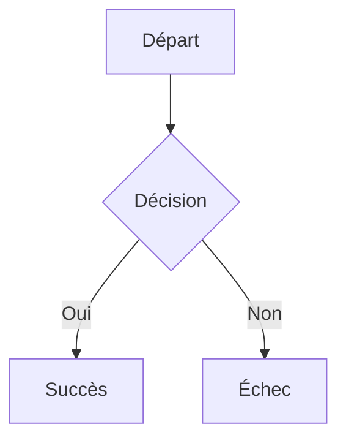

# Guide rapide

Bienvenue dans l'éditeur Docs. Voici un aperçu des fonctionnalités pour structurer vos documents (spécifications, comptes-rendus)

## 📝 Mise en forme & Styles

-   **Gras**, _italique_
    
-   **Couleur du texte** : Utilisez l'icône **A** dans la barre d'outils 
    
-   **Surligné**  : Utilisez l'icône de surligneur ou tapez `==contenu surligné==`

- **Barré** : Utilisez l'icône de barré ou tapez `~~contenu barré~~`

## 📃 Listes et tâches

1. Utiliser un `-` pour une liste à puces.
2. Utiliser un `1.` pour une liste numérotée.
3. Utiliser un `[]` ou `[x]` pour une tâche. Les tâches peuvent être cochées/décochées.
- [] Tâche à cocher
- [x] Tâche cochée

## 💡 Blocs d'alerte (Blockquotes)

Ajoutez des blocs colorés. Le titre est éditable.

> Citation sans titre. Tapez `> `

> [!NOTE] Titre
> Ceci est une note informative. Tapez `>note` ou `>[!note]`

> [!TIP] Titre
> Voici un conseil utile pour gagner du temps. Tapez `>tip`, `>conseil` ou `>[!tip]`

> [!IMPORTANT] Titre
> Une information cruciale à ne pas manquer. Tapez `>important` ou `>[!important]`

> [!WARNING] Titre
> Une alerte demandant votre attention. Tapez `>alerte` ou `>[!warning]`

> [!CAUTION] Titre
> Attention, action potentiellement risquée. Tapez `>attention` ou `>[!caution]`

## 🏷️ Libellés

Ajoutez des libellés pour classer vos informations. Tapez ``` suivi du nom du tag pour ouvrir la **recherche automatique** et sélectionner ou créer un libellé en fermant la ```.

## 📦 Blocs dépliables

Idéal pour masquer du contenu secondaire ou des détails techniques. Tapez `>>` pour créer un bloc dépliable

> > Bloc 1
> Contenu dépliable
> > Bloc 1.1
> Contenu dépliable

## 📊 Tableaux

Utilisez l'icône **Table** pour insérer un tableau.

-   **Lignes/Colonnes** : Cliquez sur une cellule pour voir apparaître les boutons de gestion (ajouter/supprimer).
    
-   **Couleurs de fond** : Utilisez l'icône **Palette** sur une cellule ou une sélection pour changer la couleur de fond du tableau.
    

| Tâche | Statut | Responsable |
| --- | --- | --- |
| **Design** | `Terminé` | Case coloriée |
| Dev | `En cours` | Texte colorié |

## 🧜‍♂️ Diagrammes Mermaid

Générez des diagrammes à partir de texte. Avec la possibilité d'éditer directement le code ou le diagramme ou en prompt.

````

````


## ✨ IA & Modes Spéciaux

L'assistance IA puissante.

-   **Suggérer** : L'IA utilise le ==surlignage== pour les ajouts et ~~le barré~~ pour les suppressions. Vous pouvez ensuite accepter ou refuser les modifications.
    

---

_Ce guide est un mémo interactif : n'hésitez pas à tester !_
