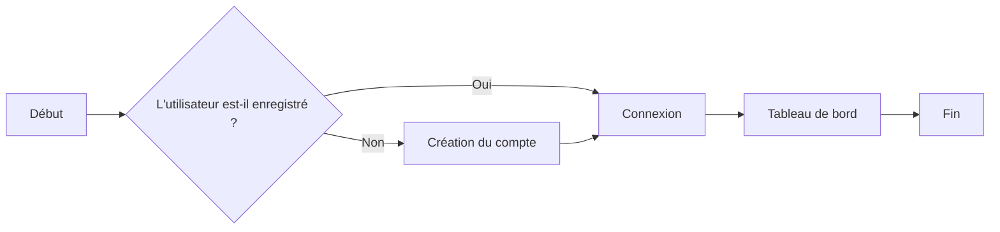
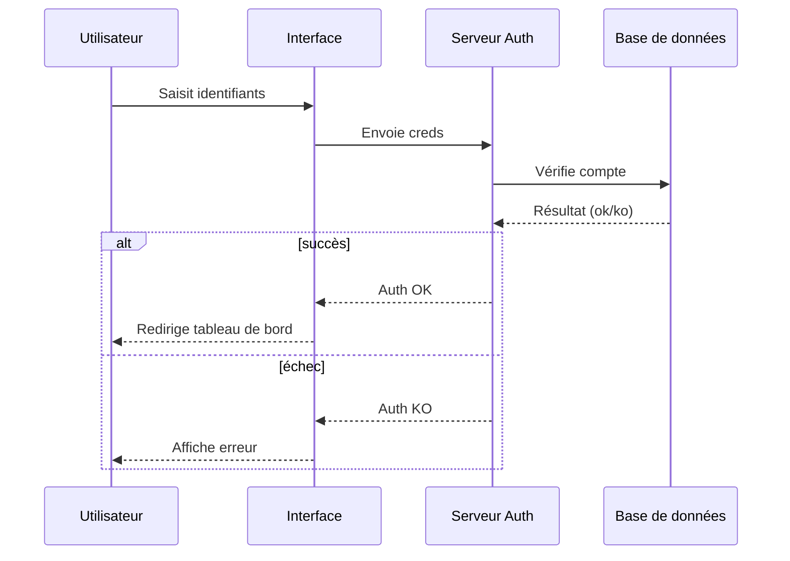
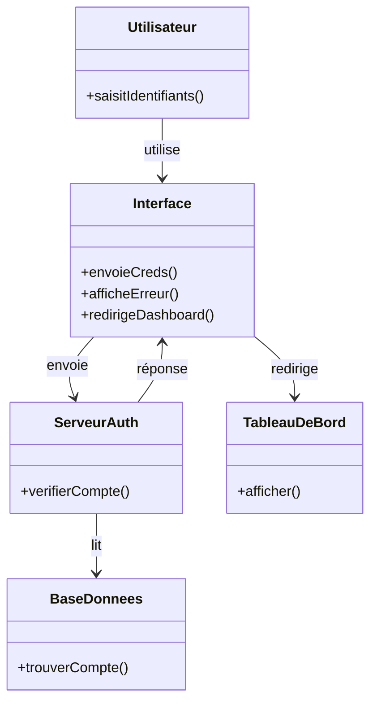
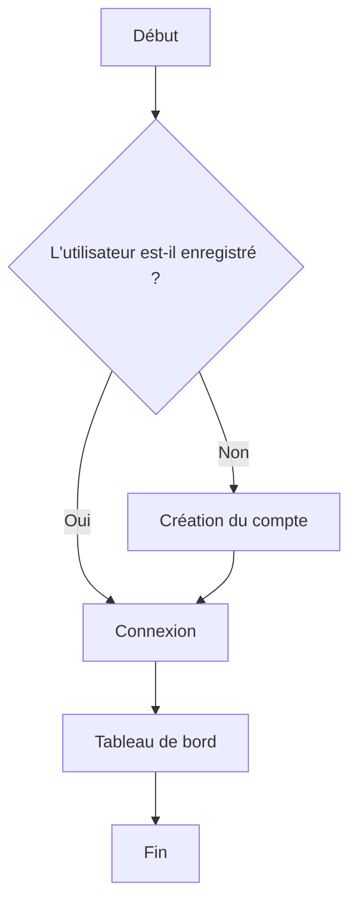

# **Guide Édition Mémo ✏️**

Bienvenue dans l'éditeur Mémo. Voici un aperçu des fonctionnalités pour structurer vos documents (spécifications, comptes-rendus)

## **🔤 Mise en forme & Styles**

-   **Gras**, italique
    
-   **Couleur du texte** : Utilisez l'icône **A** dans la barre d'outils
    
-   **Surligné** : Utilisez l'icône de surligneur ou tapez contenu surligné
    
-   **Barré** : Utilisez l'icône de barré ou tapez --~contenu barré~\--
    

## **📃 Listes**

-   Utiliser un -\\ pour une liste à puces.
    
-   Utiliser un 1.\\ pour une liste numérotée.
    

## 📋Tâches

Utiliser un `[]` ou `[x]` pour une tâche. Les tâches peuvent être cochées/décochées.

 ☐ Tâche à faire
 ☐ Tâche terminé

## **💡 Blocs d'alerte (Blockquotes)**

Ajoutez des blocs colorés. Le titre est éditable.

> Ceci est une citation. Taper `>`

> ℹ️ Ceci est une note informative. Tapez `>note`

> 💡 Conseil Voici un conseil utile pour gagner du temps. Tapez `>tip`

> ✅ Une information cruciale à ne pas manquer. Tapez `>important`

> ⚠️ Une alerte demandant votre attention. Tapez `>alerte`

> 🚨 Attention, action potentiellement risquée. Tapez `>attention\`

## 🏷️ Libellés

Les libellés permettent de classer vos informations.

Tapez ``\`\`` suivi du texte du libellé pour l’ajouter. L’autocomplétion propose les libellés déjà existants. Vous pouvez préciser une couleur ou u style

-   État : `À faire` `En cours` `Terminé`
    
-   Terminologie informatique : **`POST`** **`PUT`** **`PATCH`** **`GET`**
    
-   Clé-valeur : `id` `object.key` `array[]`
    

| Tâche | Responsable | État |
| --- | --- | --- |
| \\\[ \\\] Rédiger le brief | Alice | \`À faire\` |
| \\\[x\\\] Valider le design | Bob | \`Terminé\` |
| \\\[ \\\] Déployer en prod | Charlie | \`En cours\` |

-   **Lignes/Colonnes** : Cliquez sur une cellule pour voir apparaître les boutons de gestion (ajouter/supprimer).
    
-   **Couleurs de fond** : Utilisez l'icône **Palette** sur une cellule ou une sélection pour changer la couleur de fond du tableau.
    
-   **Sommaire interactif** : Utiliser pour naviguer rapidement, avec des en‑têtes pliables afin d’organiser et de masquer les sections du document.
    

## **🧜‍♂️ Diagrammes Mermaid**

Générez des diagrammes à partir de texte. Avec la possibilité d'éditer directement le code.

```
flowchart TD
    A[Début] --> B{L'utilisateur est‑il enregistré ?}
    B -- Oui --> C[Connexion]
    B -- Non --> D[Création du compte]
    D --> C
    C --> E[Tableau de bord]
    E --> F[Fin]
```

#### **Diagramme flux en vertical**



#### **Diagramme processus en séquentiel**



#### **Diagramme structure d'objets**



#### Diagramme de flux horizontal



## **✨ IA & Modes Spéciaux**

L'assistance IA puissante.

-   **Suggérer** : L'IA utilise le surlignage pour les ajouts et le barré pour les suppressions. Vous pouvez ensuite accepter ou refuser les modifications.
    
-   **Éditer** : Permet de modifier le document avec ou sans sélection. Sans sélection, les changements sont ajoutés à la fin du document.
    
-   **Importer** : Convertit un fichier (media, audio, texte) en texte mis en forme dans Mémo.
    
-   **Dessiner** : Crée des diagrammes visuels et puissants via Mermaid ou d’autres outils.
    
-   **Demander** : Pose des questions sans éditer le document, en s’appuyant sur les fichiers‑joints (media, image, texte, données).
    

## ⌨️Raccourcis claviers

### ✅ Essentiels

\- 📋 Copier : Ctrl+C

\- ✂️ Couper : Ctrl+X

\- 📌 Coller : Ctrl+V

\- 🧼 Coller sans mise en forme : Ctrl+Shift+V

\- ↩️ Annuler : Ctrl+Z

\- ↪️ Rétablir : Ctrl+Shift+Z (parfois Ctrl+Y selon setup)

\- ⏎ Saut de ligne : Shift+Enter

\- ✅ Valider (selon context) : Ctrl+Enter

### ✍️ Mise en forme

\- **Gras** : Ctrl+B

\- _Italique_ : Ctrl+I

\- Souligné : Ctrl+U

\- ~Barré~ : Ctrl+Shift+S

\- 🖍️ Surligner : Ctrl+Shift+H

\- `Code (inline)` : Ctrl+E

### 🧱 Blocs

\- 📝 Paragraphe : Ctrl+Alt+0

\- H1…H6 : Ctrl+Alt-1..6

\- 1️⃣ Liste ordonnée : Ctrl+Shift+7

\- • Liste à puces : Ctrl+Shift+8

\- ☑️ Task list : Ctrl+Shift+9

\- ❝ Citation : Ctrl+Shift+B

\- 🧩 Code block : Ctrl+Alt+C

↔️ Alignement (si extension active)

\- ↔️ Gauche : Ctrl+Shift+L

\- ↔️ Centre : Ctrl+Shift+E

\- ↔️ Droite : Ctrl+Shift+R

\- ↔️ Justifier : Ctrl+Shift+J

Indice / ˣ Exposant (si extension active)

\- ₓ Indice : Ctrl+,

\- ˣ Exposant : Ctrl+.

### 🧠 Sélection

\- 🔘 Tout sélectionner : Ctrl+A

\- ◀️▶️ Étendre la sélection : Shift + flèches (← → ↑ ↓)