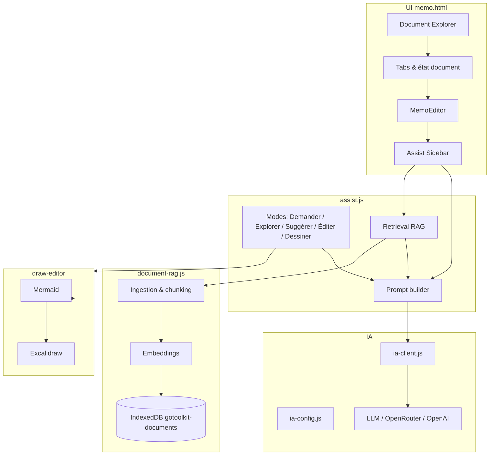

# Go-Toolkit — Documentation technique (Mémo, Assist, Draw)

## 1) Portée & audience
Cette documentation technique décrit :
- la page **memo.html**,
- le **memo-editor** (éditeur riche),
- **assist.js** (IA + RAG),
- **draw-editor** (diagrammes + Excalidraw),
- les interactions entre ces modules et l’IA selon les modes de prompt.

---

## 2) Vue d’ensemble (Mémo)
**memo.html** est l’interface principale d’édition. Elle gère :
- la **bibliothèque locale** de documents,
- les **tabs** (documents ouverts),
- l’éditeur **MemoEditor**,
- la connexion à **Assist** et au **RAG**.

### 2.0 Schéma d’ensemble (Mermaid)


### 2.1 Structure fonctionnelle
- **Document Explorer** : liste des documents locaux + statut “enregistré/partagé”.
- **Tabs** : documents ouverts (barre d’onglets).
- **Memo card** : zone d’édition principale.
- **Modals** : partage, export, templates, info.

### 2.2 Modèle de document (state)
Le document est un état JSON (tabs + metadata) persisté localement :
- `tabs[]` : contenu de chaque onglet (id, title, content, superpowers, `voiceRecordingId`).
- `activeTabId` : onglet actif.
- `templateId` / `templateLabel` : origine template.
- `promptPresetId` : mode IA par défaut.

---

## 3) memo-editor (éditeur riche)
Le memo-editor est construit via un bundle (`memo.bundle.js`) issu de **src/memo-editor/**.

### 3.1 Fonctions principales
- édition riche (paragraphes, titres, listes),
- tables, blocs de code, citations,
- **Mermaid** (diagrammes),
- export (Markdown, JSON, DOCX).

### 3.2 Nœuds techniques
Exemples de nœuds spécialisés :
- `table-node.tsx`
- `task-node.tsx`
- `blockquote-node.tsx`
- `mermaid-node.tsx`

### 3.3 Intégration IA
L’éditeur fournit :
- la sélection utilisateur,
- le contenu courant,
- la position de curseur,
aux modules Assist / IA pour les actions “Éditer” et “Suggérer”.

---

## 4) Assist (assist.js)
**assist.js** orchestre l’IA, les prompts et la RAG.

### 4.1 Rôle
- expose l’UI “Assist” (sidebar),
- gère les uploads (documents, audio),
- déclenche la récupération RAG,
- compose les prompts IA.

### 4.2 Modes de prompt (interaction avec l’IA)
Les modes influencent la **composition du prompt** et les **sources** :

1. **Demander**
	- génération libre,
	- pas d’obligation de RAG.

2. **Explorer**
	- recherche dans la base RAG,
	- passages pertinents injectés dans le prompt,
	- l’IA répond avec contenu sourcé.

3. **Suggérer**
	- génération d’idées complémentaires,
	- peut utiliser la sélection ou le contexte du mémo.

4. **Éditer**
	- applique une transformation sur une **sélection**,
	- retourne un diff que l’utilisateur peut accepter/refuser.

5. **Dessiner**
	- produit du code Mermaid ou des structures de diagramme,
	- utilise draw-editor pour prévisualisation.

### 4.3 Pipeline IA (simplifié)
1. Collecte du contexte
	- sélection du memo-editor,
	- métadonnées du document,
	- passages RAG (si mode Explorer).
2. Choix du modèle & du provider (`ia-config.js`).
3. Normalisation streaming (`ia-client.js`).
4. Injection du résultat dans l’UI et, si besoin, dans l’éditeur.

### 4.4 Interaction avec les prompts
Les templates de prompt sont centralisés dans `public/prompt.js`.
Les **presets** (ex : edit/suggest/advice) déterminent :
- le rôle du système,
- le ton,
- la structure de la réponse,
- la manière d’intégrer la RAG.

#### 4.4.1 Structure des prompts (prompt.js)
`prompt.js` expose un registre global `GoToolkitChatPrompt.PRESETS` avec :
- **advice** (Demander),
- **ask** (Explorer),
- **suggest** (Suggérer),
- **edit** (Éditer),
- **import** (Importer),
- **draw** (Dessiner),
- **extract** (OCR).

Chaque preset fournit :
- `id`, `label`, `icon`,
- `prompt` (actif),
- `defaultPrompt` (prompt de référence).

#### 4.4.2 Format de sortie attendu (JSON strict)
Les prompts exigent **un JSON strict** pour garantir un parsing fiable côté UI. Si l'IA produit du texte en dehors du JSON, celui-ci est ignoré par le parser.

**Champs principaux :**
- `answer` : Réponse textuelle principale affichée dans la bulle de chat.
- `references[]` : Liste d'objets `[{"id": "...", "title": "..."}]` pour citer les sources RAG.
- `suggestions[]` : Liste de textes courts (boutons d'action rapide sous la réponse).
- `output` : Contenu Markdown complet à insérer/remplacer dans le document.
- `s_output` : Contenu Markdown spécifique pour remplacer une sélection active.
- `mermaid` : Code source Mermaid pour génération de diagramme.
- `operations[]` : (Legacy) Liste d'opérations d'édition par index (replace/insert/delete).

**Note sur la robustesse du champ `answer` :**
Le parser accepte deux formats pour le texte principal :
1. `"answer": "Texte de la réponse"` (Format standard).
2. `"answer": { "content": "Texte de la réponse" }` (Format étendu supporté par certains modèles).

**Exemples par mode :**

1. **Demander / Explorer (RAG)**
```json
{
  "answer": "Voici les informations trouvées...",
  "references": [
    { "id": "doc_123", "title": "Rapport Annuel.pdf" }
  ],
  "suggestions": ["En savoir plus", "Résumé court"]
}
```

2. **Éditer (Transformation de sélection)**
```json
{
  "answer": "J'ai reformulé votre texte pour le rendre plus professionnel.",
  "s_output": "Le texte reformulé ici..."
}
```

3. **Suggérer (Génération document)**
```json
{
  "answer": "Voici une proposition de structure.",
  "output": "# Titre\nContenu suggéré..."
}
```

4. **Dessiner (Diagrammes)**
```json
{
  "answer": "Voici le diagramme de flux demandé.",
  "mermaid": "graph TD\nA --> B"
}
```

**Traitement du flux (Streaming) :**
`assist.js` utilise une approche hybride pour afficher la réponse pendant sa génération :
1. **Tentative de parsing JSON** à chaque chunk. Si réussi, le champ `answer` est mis à jour en temps réel.
2. **Fallback Regex** : Si le JSON est incomplet (pendant le stream), une fonction `extractContent()` tente d'extraire la valeur stockée dans la clé `"content"` ou `"answer"` pour ne pas bloquer l'affichage.
3. **Validation finale** : À la fin du stream, le JSON complet est parsé. S'il est invalide, Assist tente de "nettoyer" la chaîne (suppression de texte parasite avant/après les accolades) via `sanitizeEmbeddedJson()`.

#### 4.4.3 Règles transverses appliquées par les prompts
- Langue : **français**, tutoiement professionnel.
- Limite de longueur : ~150 mots (selon mode).
- Pas d’emoji, pas de texte hors JSON.
- Respect des structures Markdown (titres, listes, tâches, tableaux).
- Encadrés Markdown typés (ℹ️, 💡, ✅, ⚠️, 🚨) supportés.

#### 4.4.4 Injection du contexte
Le builder de prompt assemble :
- **DOCUMENT** (contenu mémo),
- **SELECTION** (optionnelle),
- **CONTEXT** (chunks RAG),
- **ASK** (demande),
- **HISTORY** (dernier historique),
- **KNOWLEDGE / PRODUCT** (si mode conseil).

#### 4.4.5 Effets côté UI
- Validation stricte du JSON : si le format est invalide, la réponse est rejetée.
- Les champs `output` / `s_output` sont appliqués au memo-editor.
- Les références RAG sont affichées en sources (si présentes).

---

## 5) Draw-editor (diagrammes)
**draw-editor** (src/draw-editor/index.tsx) fournit :
- intégration Excalidraw,
- normalisation Mermaid,
- exposition d’API globale `window.GoToolkitDrawMemo`.

### 5.1 Flux Mermaid
1. L’utilisateur saisit un diagramme Mermaid.
2. draw-editor rend une preview via Excalidraw.
3. L’éditeur persiste la représentation dans l’état du mémo.

### 5.2 IA + Dessiner
Le mode **Dessiner** d’Assist génère :
- un code Mermaid,
- ou une structure de diagramme,
puis appelle draw-editor pour afficher/rendre.

---

## 6) Interactions clés entre Mémo, Assist et IA
### 6.1 Éditer un texte
1. L’utilisateur sélectionne un passage.
2. Assist compose un prompt “Éditer”.
3. L’IA renvoie un contenu modifié.
4. L’utilisateur choisit **Accepter** ou **Annuler**.

### 6.2 Explorer (RAG)
1. Assist déclenche `vectorSearch()` dans `document-rag.js`.
2. Les passages sont injectés au prompt.
3. L’IA répond avec des références contextuelles.

### 6.3 Suggérer / Demander
1. Assist se base sur le mémo actif.
2. Pas d’obligation d’utiliser le RAG.
3. Résultat inséré dans l’éditeur ou en réponse textuelle.

---

## 7) Stockage & persistance
### 7.1 Documents Mémo
- stockés via `goToolkitDocumentApi` (localStorage + wrappers).
- chaque document conserve son payload `tabs[]`.

### 7.2 RAG (base locale)
- IndexedDB `gotoolkit-documents`.
- séparé par `conversationId`.

---

## 8) Points d’entrée techniques
- memo.html : orchestration UI + état du document.
- public/js/assist.js : UI IA + prompts + RAG.
- public/js/document-rag.js : ingestion et retrieval.
- src/memo-editor/* : composants de l’éditeur.
- src/draw-editor/index.tsx : Excalidraw bridge.
- public/js/ia-client.js + public/js/ia-config.js : appels IA.
