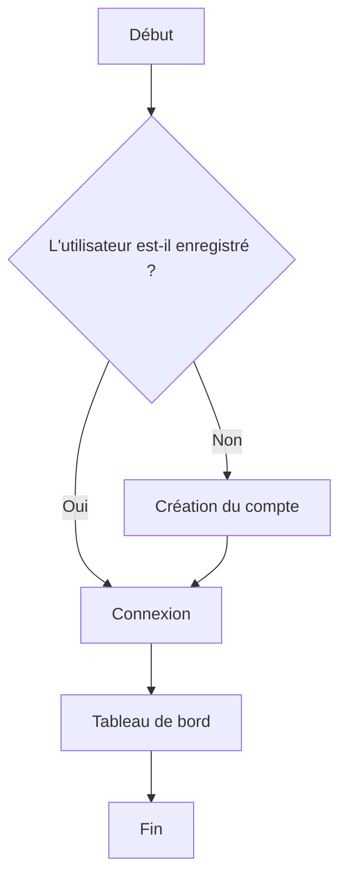

# Guide Mémo

Bienvenue dans l'éditeur Mémo. Voici un aperçu des fonctionnalités pour structurer vos documents (spécifications, comptes‑rendus).

## 📝 Mise en forme & Styles

-   **Gras**, _italique_
    
-   Couleur du texte : Utilisez ônel'ic A dans la barre d'outils
    
-   Surligné : Utilisez l'icône de surligneur ou tapez `contenu surligné`
    
-   Barré : Utilisez l'icône de barré ou tapez `~~contenu barré~~`
    

## 📃 Listes

-   Utiliser `-` pour une liste à puces.
    
-   Utiliser `1.` pour une liste numérotée.
    

## 📋 Tâches

-   Tâche à faire
    
-   Tâche terminée
    

## 💡 Blocs d'alerte (Blockquotes)

> Ceci est une citation.

> ℹ️ \> Ceci est une note informative.

> 💡 \> Conseil : voici un conseil utile pour gagner du temps.

> ✅ \> Une information cruciale à ne pas manquer.

> ⚠️ \> Une alerte demandant votre attention.

> 🚨 \> Attention, action potentiellement risquée.

## 🏷️ Libellés

Les libellés permettent de classer vos informations.

Tapez `` \` `` suivi du texte du libellé pour l’ajouter. L’autocomplétion propose les libellés déjà existants. Vous pouvez préciser une couleur ou un style.

État : `À faire`, `En cours`, `Terminé`

Terminologie informatique : `POST`, `PUT`, `PATCH`, `GET`

Clé‑valeur : `id`, `object.key`, `array[]`

| Tâche | Responsable | Échéance |
| --- | --- | --- |
| Implémenter l'authentification | Alice | 2024-10-01 |
| Rédiger la documentation | Bob | 2024-10-07 |
| Tester l'interface | Charlie | 2024-10-10 |
| Déployer en production | Diana | 2024-10-15 |

## ✨ IA & Modes Spéciaux

L'assistance IA puissante.

Suggérer : L'IA utilise le surlignage pour les ajouts et le barré pour les suppressions. Vous pouvez ensuite accepter ou refuser les modifications.